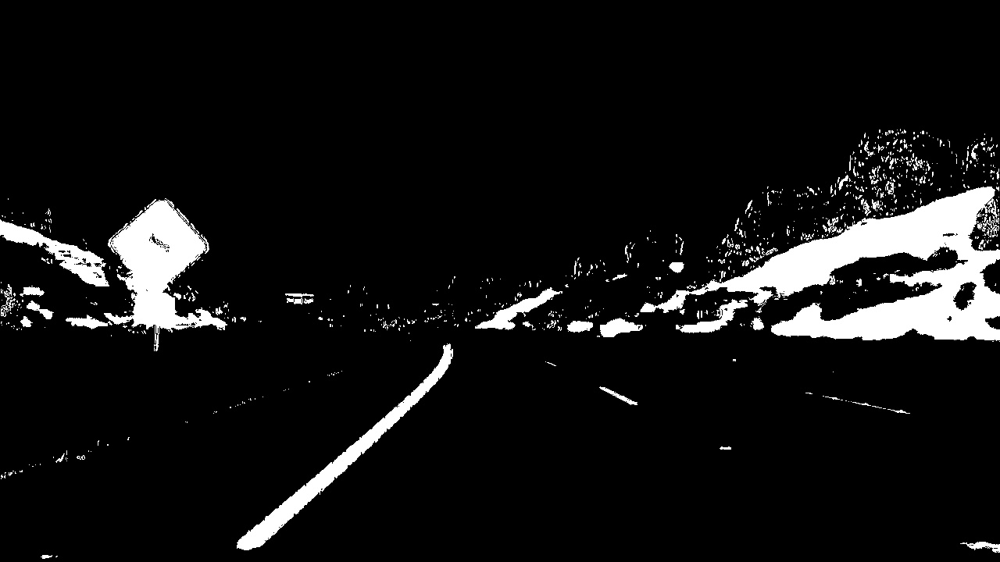
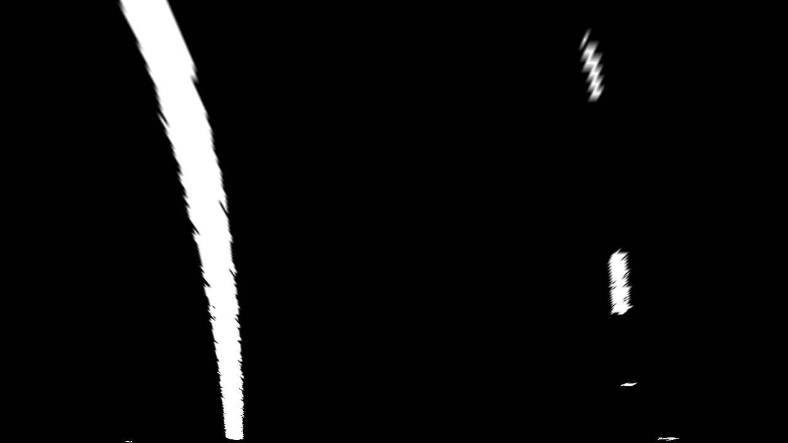
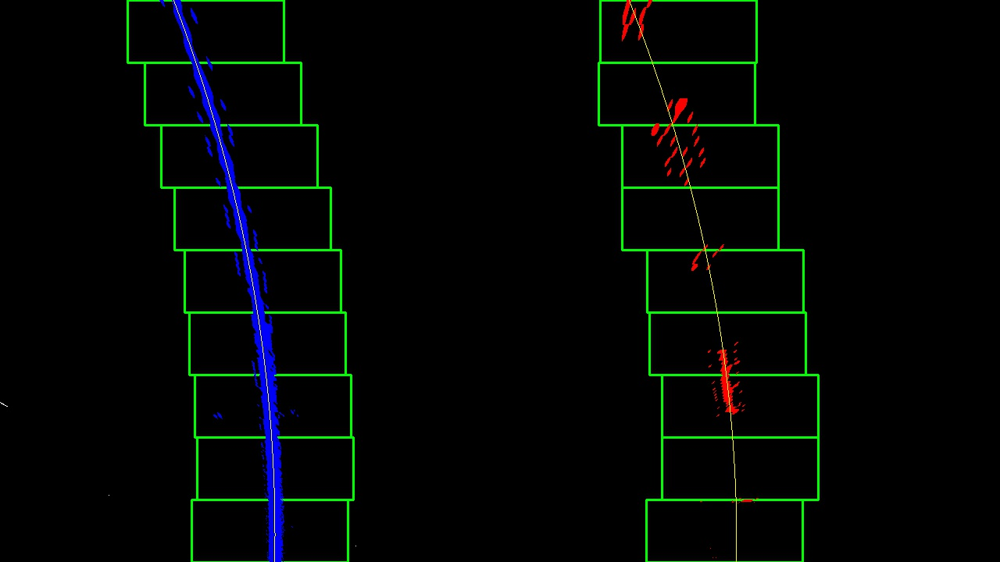
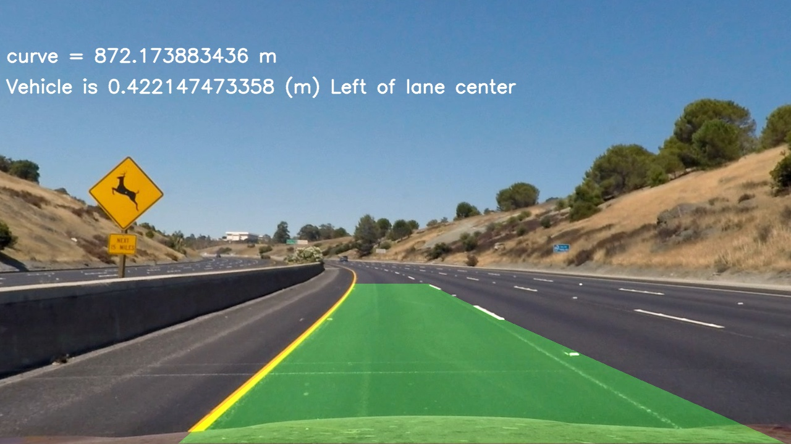

##Advanced Lane Finding Project

The goals / steps of this project are the following:

* Compute the camera calibration matrix and distortion coefficients given a set of chessboard images.
* Apply a distortion correction to raw images.
* Use color transforms, gradients, etc., to create a thresholded binary image.
* Apply a perspective transform to rectify binary image ("birds-eye view").
* Detect lane pixels and fit to find the lane boundary.
* Determine the curvature of the lane and vehicle position with respect to center.
* Warp the detected lane boundaries back onto the original image.
* Output visual display of the lane boundaries and numerical estimation of lane curvature and vehicle position.

## [Rubric](https://review.udacity.com/#!/rubrics/571/view) Points

### Here I will consider the rubric points individually and describe how I addressed each point in my implementation.  

---

### Writeup / README

#### 1. Provide a Writeup / README that includes all the rubric points and how you addressed each one.  You can submit your writeup as markdown or pdf.  

You're reading it!

### Camera Calibration

#### 1. Briefly state how you computed the camera matrix and distortion coefficients. Provide an example of a distortion corrected calibration image.

The code for this step is in lines 12 through 61 of the file called `PreProcessing.py`).  

I start by preparing "object points", which will be the (x, y, z) coordinates of the chessboard corners in the world. Here I am assuming the chessboard is fixed on the (x, y) plane at z=0, such that the object points are the same for each calibration image.  Thus, `objp` is just a replicated array of coordinates, and `objpoints` will be appended with a copy of it every time I successfully detect all chessboard corners in a test image.  `imgpoints` will be appended with the (x, y) pixel position of each of the corners in the image plane with each successful chessboard detection.  

I then used the output `objpoints` and `imgpoints` to compute the camera calibration and distortion coefficients using the `cv2.calibrateCamera()` function.  I applied this distortion correction to the test image using the `cv2.undistort()` function and obtained this result: 

### Pipeline (single images)

#### 1. Provide an example of a distortion-corrected image.

To demonstrate this step, I will describe how I apply the distortion correction to one of the test images like this one:

#### 2. Describe how (and identify where in your code) you used color transforms, gradients or other methods to create a thresholded binary image.  Provide an example of a binary image result.

I used a combination of color gradient thresholds in HLS color domain, color threshold in LAB color domain and Lightness threshold in LAB color domain to generate a binary image. I applied the color threshold on the B layer, lightness threshold on L layer and performed a sobel prt X on the S Layer. (thresholding steps at lines 79 through 109 in `PreProcessing.py`).  Here's an example of my output for this step.

#### 3. Describe how (and identify where in your code) you performed a perspective transform and provide an example of a transformed image.

The code for my perspective transform includes a function called `get_transform_matrix()`, which appears in lines 70 through 72 in the file `PreProcessing.py`.  The `get_transform_matrix()` function takes as inputs source (`src`) and destination (`dst`) points.  I chose the hardcode the source and destination points in the following manner:

| Source        | Destination   | 
|:-------------:|:-------------:| 
| 203, 720      | 320, 720        | 
| 585, 460      | 320, 0      |
| 695, 460     | 960, 0      |
| 1127, 720      | 960, 720        |

An example of a perspective transformed image is bellow.

#### 4. Describe how (and identify where in your code) you identified lane-line pixels and fit their positions with a polynomial?

Then I performed a blind sliding window search on the transformed image to detect lane lines. For video frames i used previous lane info as a start point and performed a guided search for the lane lines. Then I fitted the found lane points to a 2nd order polynomial. I also added some sanity checks to gain confedence about my detections. The code for my implementation in in `LaneFinding.py` in lines 17 through 98.

#### 5. Describe how (and identify where in your code) you calculated the radius of curvature of the lane and the position of the vehicle with respect to center.

I did this in lines 6 through 14 in my code in `support.py`

#### 6. Provide an example image of your result plotted back down onto the road such that the lane area is identified clearly.

I implemented this step in lines 125 through 149 in my code in `main.py` in the function `draw_lane_area()`.  Here is an example of my result on a test image:

---

### Pipeline (video)

#### 1. Provide a link to your final video output.  Your pipeline should perform reasonably well on the entire project video (wobbly lines are ok but no catastrophic failures that would cause the car to drive off the road!).

Here's a [link to my video result](./output_videos/project_video.mp4)

---

### Discussion

#### 1. Briefly discuss any problems / issues you faced in your implementation of this project.  Where will your pipeline likely fail?  What could you do to make it more robust?

* The binary data extraction method i used is very limited. This is the main reason of the system failure when testing on the challenge video. A further tuned binary extraction function would definitely lead to a more robust perception.
* Further sanity checks could help improve the tracking quality (Ex. checking that the lane lines are parallel...etc).
